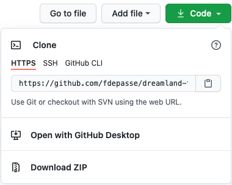
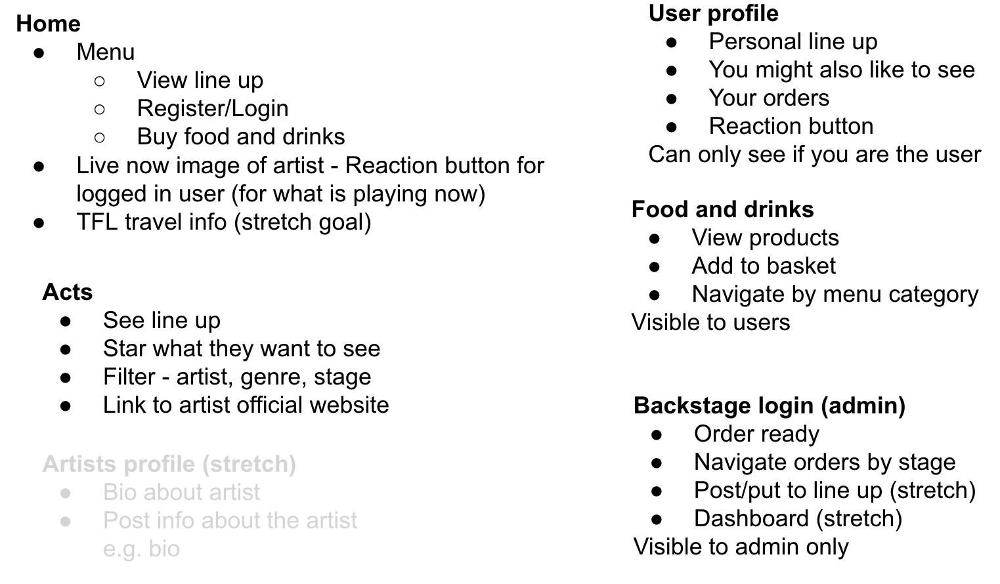
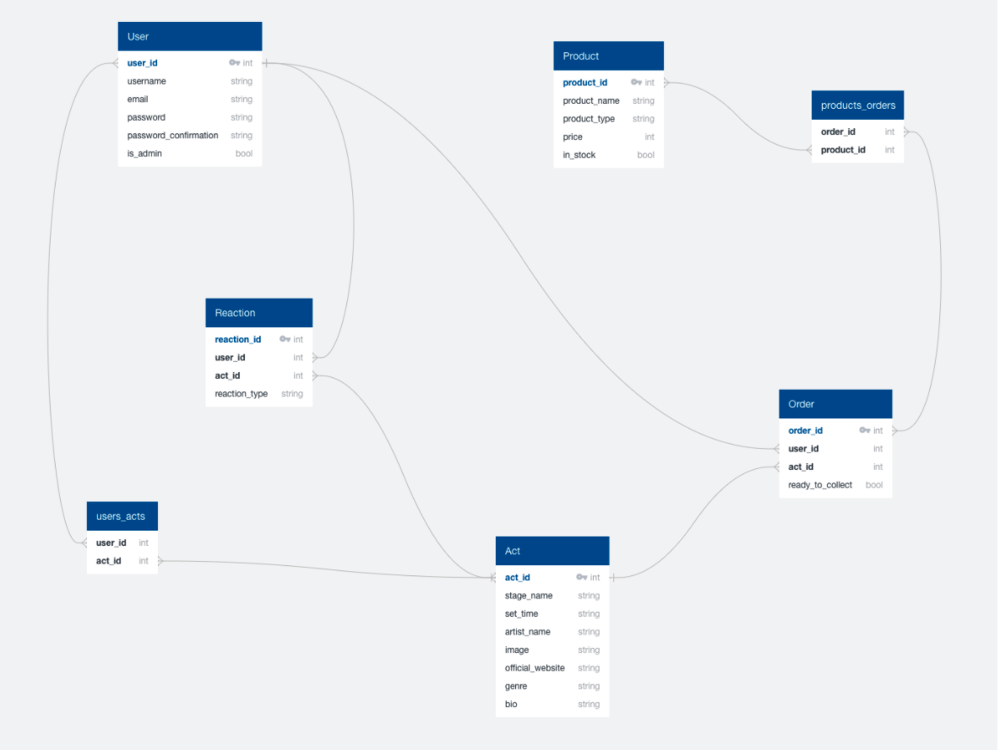
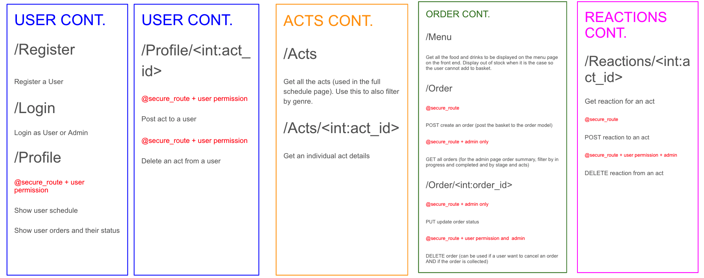
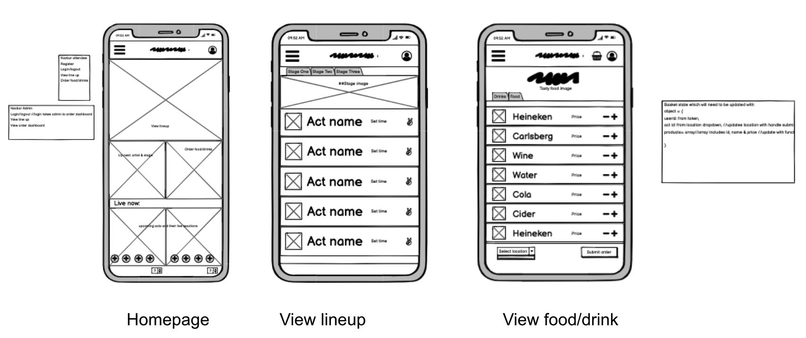
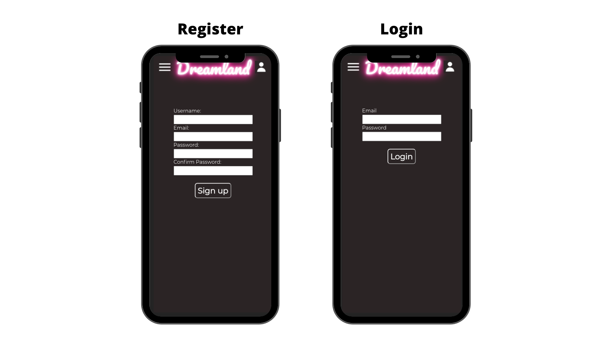
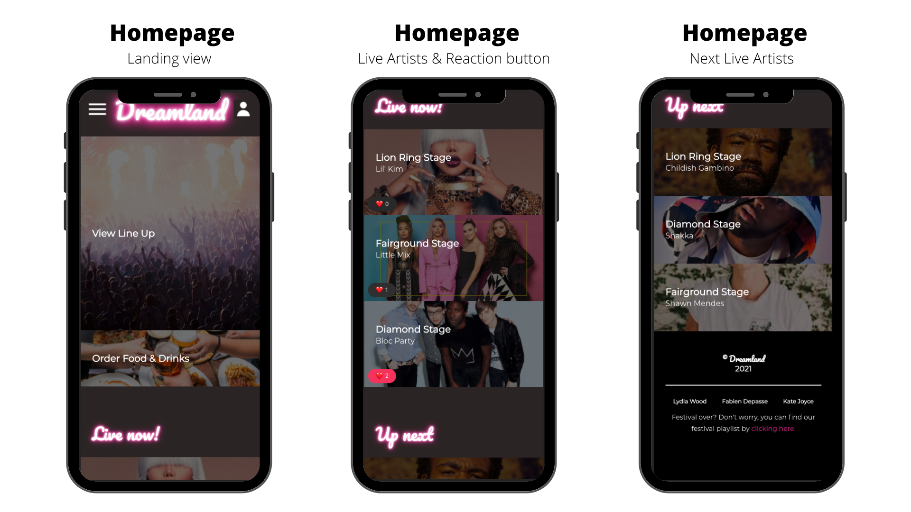
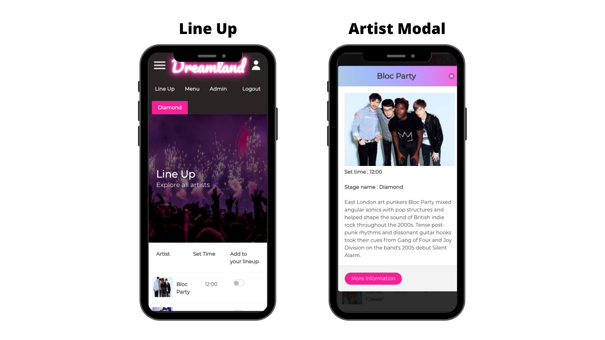
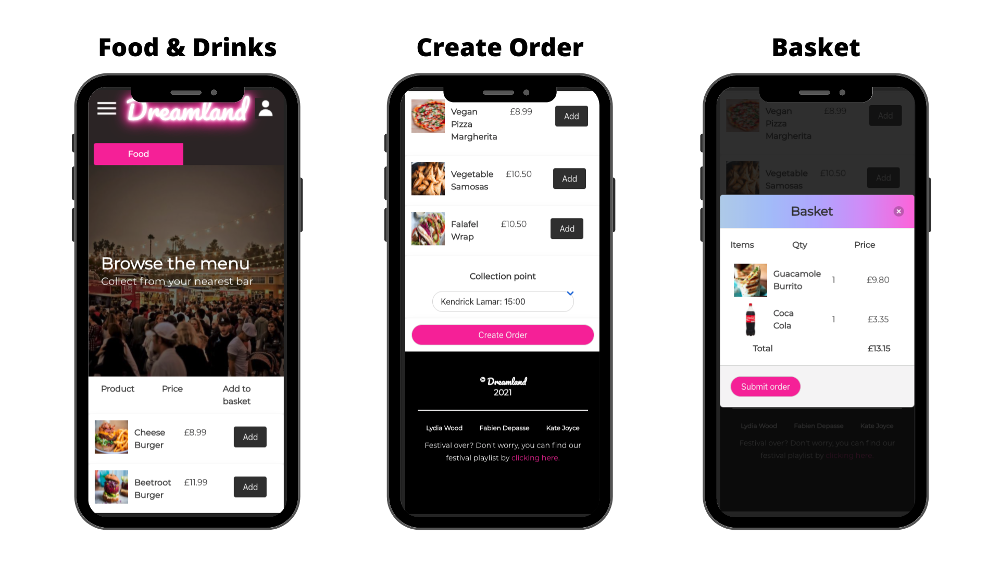
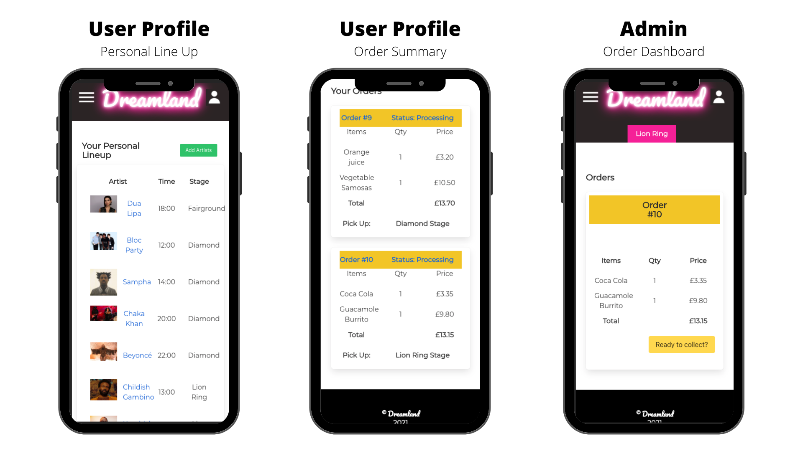

# <p><span>Dreamland Festival</span></p>

<br/><br/>

<p align="center"></p>

<br/><br/>

## Table of Contents
* [Overview](#overview)
* [Getting Started](#getting-started)
* [Project Brief](#brief)
* [Technologies Used](#technologies)
* [Team Responsibilities](#team)
* [Approach](#approach)
* [Featured Code](#featured-code)
* [App Walk Through](#app-walk-through)
* [Enhancements](#enhancements)
* [Wins, Challenges & Learnings](#wins-and-challenges)

<br/>

## <a name="overview"></a>Overview
This was the final project from the Software Engineering Immersive Course I took at General Assembly London, built after 11 weeks of class.

It was a **group** project with 3 team members and the timeline was  **7 days**.

The purpose of the application is for the attendees to our fictional “Dreamland Festival” to see the line-up, plan their personal schedule and order food on the day of the event. Staff have admin access, allowing them to see all orders and flag them as processed or completed.

It is a mobile first, full stack application built with React JS, Python, Flask, SQLAlchemy, Marshmallow and talking to a PostgreSQL Database. 

>Access the **app** [here](http://dreamland-festival.herokuapp.com/) and the **repository** [here](https://github.com/fdepasse/dreamland-festival)


<br/>


## <a name="getting-started"></a>Getting Started
Click the "Code" button on the [repository](https://github.com/fdepasse/dreamland-festival) and choose either to **Clone** it or to **Download ZIP** the files.

<p align="center"></p>

You need to install [Node.js](https://nodejs.org/en/), [Python 3](https://www.python.org/) and [PostgreSQL](https://www.postgresql.org/) to be able to proceed with the rest of the steps. Once installed and the repository files are on your machine, open your Command Line Interface (CLI), navigate to the root of the project and run the following commands:

* `pipenv install` to install the backend dependencies
* `npm i` to install the frontend dependencies
* `createdb dreamland_db` to create a PostgreSQL database
* `npm run seed` to seed the database
* `npm run start` to start the Flask server
* `npm run serve` to run the front end and see the app in your browser

<br/>

## <a name="brief"></a>Project Brief
* Build a full-stack application by making your own backend and your own frontend
* Use a Python Flask API using a Flask REST Framework to serve your data from a PostgreSQL database
* Consume your API with a separate frontend built with React
* Be a complete product which most likely means multiple relationships and CRUD functionality for at least a couple of models
* Implement thoughtful user stories/wireframes that are significant enough to help you know which features are core MVP and which you can cut
* Have a visually impressive design
* Be deployed online so it's publicly accessible

<br/>

## <a name="technologies"></a>Technologies Used

|   Frontend   |   Backend   | Testing |    Development Tools    |
|:------------:|:-----------:|:-------:|:-----------------------:|
|   React JS   |    Python   |  pytest |         VS Code         |
| React Router |    Flask    |         |     Git (branching)     |
|     Babel    | SQL Alchemy |         |          GitHub         |
|    Webpack   | Marshmallow |         | Google Chrome Dev Tools |
|     Axios    |  PostgreSQL |         |           Zoom          |
|     Bulma    |    bcrypt   |         |          Slack          |
|     Sass     |     jwt     |         |         Balsamiq        |
|    Node.js   |             |         |         Insomnia        |
|              |             |         | Quick Database Diagrams |
|              |             |         |      Google Slides      |
|              |             |         |          Trello         |

<br/>

## <a name="team"></a>Team Responsibilities

|          |                        [Fabien Depasse](https://github.com/fdepasse)                       |        [Kate Joyce](https://github.com/kate1562)        |                              [Lydia Wood](https://github.com/lydiarrrw)                              |
|:--------:|:------------------------------------------------------------------------------------------:|:-------------------------------------------------------:|:----------------------------------------------------------------------------------------------------:|
|  Backend | User Model / Authentication / Permission <br/> Reaction Model <br/> Secure Route decorator |     Product Model <br/> Order Model <br/> Act Model     | User Model / Authentication / Permission <br/> Reaction Model <br/> Error Handler & Logger decorator |
| Frontend |  Home page Live Artists functionality <br/> Home page Reaction button <br/> User profile   | Order system and Menu page <br/> Line Up page and Modal |               Login & Register features <br/> Nav bar <br/> Admin order dashboard <br/>              |

<br/>

## <a name="approach"></a>Approach
### Step 1: Planning


#### Problem #1: Deciding on our App Functionalities
We started by listing the features we wanted to include in our app, the pages we would need and the type of permission each feature would need (attendee or admin access). We also at this point defined what our MVP would be and identified some strectch goals.

<br/>

<p align="center">Our original plan<p/>

<br/>

#### Problem #2: Planning our Models & relationships, Views, Controllers (MVC) and decorators for our API 
From there we used [Quick DBD](https://www.quickdatabasediagrams.com/), an Entity Relationship Diagram tool to understand which models, which fields and their data type as well as which relationships between models we would need. We ended up with 5 models: User, Product, Reaction, Act and Order resulting in 5 tables in our database. We identified 5 different relationships to support our features, 3 being one-to-many and 2 many-to-many. For our many-to-many relationships we created 2 relationships tables: `users_acts` and `products_orders`. 

<p align="center"><p/>

We then detailed what views and controllers would need to serve our users on the frontend. We defined our routes including any dynamic paths we would need to pass information on (i.e. ids), grouped them by the relevant controller anb specified which routes would need to be decorated by our `@secure_route` decorator.

> `@secure_route` is a decorator we put in place to ensure the user trying to call the API is logged in and is a valid user. To achieve this we check the user have a valid token, which they should have received at login (using [Json Web Token library](https://jwt.io/)). If this is the case, the API can be called. Another useful feature of `@secure_route` is to decode the user token to extract the payload. Because the user id is stored on the paylod, decoding the token allows us to check at any point who is the user logged in and therefore put in place permission rules for our endpoints (i.e. users are only allowed to see their own profile).

<br/>

<p align="center">Our views and controllers plan<p/>

<br/>

#### <a name="wireframe"></a>Problem #3: Designing the User Interface (UI) 
We then went on to think about how our UI should look. We used the wireframe tool [Balsamiq](https://balsamiq.com/) for this. We also included side notes to specify which backend end points we would need on which page, where we would need user permission to change the interface and how to implement it. This has been a really helpful roadmap to follow when building the frontend to understand which React components we would need and how to build them.

<p align="center">An example of our wireframe<p/>

<br/>

<hr/>

### Step 2: Building and Testing the Backend
#### Problem #1: Setting up our app and building the backend 
We started by configuring our Flask app as a group so we could share the same code base. Next we built our SQLAlchemy Models and Marshmallow Serializers, each of us [focusing on a particular area](#team). We then needed to seed our database with some data and see if our models were working. We split the task and each of us came up with a stage name, some artists, food and beverages. We created a seed file as a group and went on to populate our database. Next, we started writing our controllers which would support our features. At this point we [split](#team) the work again and regrouped to tackle blockers together.

<br/>

#### Problem #2: Testing the backend with integration tests 
Once we were happy with our controllers, we wanted to have a go and write automated integration tests with [pytest](https://docs.pytest.org/en/stable/) to test our backend. We tested all models with a few of our controllers. Please see an example where we are testing a user cannot add 2 acts to their personal line-up that are performing at the same time:

```
def test_schedule_clash():
    client = app.test_client()

    token = bob_login(client)

    request_headers = {"Authorization": f"Bearer {token}"}

    act_response1 = client.put("api/profile/15", headers = request_headers)
    assert len(act_response1.json["acts"]) == 1

    act_response2 = client.put("api/profile/3", headers = request_headers)
    assert act_response2.status_code == 403
    assert len(act_response2.json["acts"]) == 1
```

</br>

<hr/>


### Step 3: Building the Frontend
#### Problem #1: Building our components in React
Now that we knew the backend was working as expected,  we went back to our [wireframe](#wireframe) and broke down our project into React components. We then [allocated features](#team) to build to each member of the team and had regular group catch ups to check on each other's progress and troubleshoot blockers.

<br/>

#### Problem #2: Styling our app
As we built components, we all added minimum styling using the CSS framework Bulma. Once all our features were completed we agreed on a styling theme to make sure we have consistency in the final product. Each team member has been assigned a few components to style in line with the agreed scheme. We used the CSS framemork Bulma for the most part but have customised it at times to fit our color scheme. We also used our own CSS in places.

<br/>

## <a name="featured-code"></a>Featured Code
One of the most interesting and challenging feature I built on this project was the **reaction button** .

Users can click the button to **like or unlike a live artist** on the Home page. The idea being people can in real time react to the concert they are attending. 

On the **frontend** I created a separate component called `Reaction` which renders on the Home page. The `Home` component passes the live artists' id as props to the `Reaction` component . The id is then used in the reaction component to update the dynamic path of our API end point. The API controller can then be called in a `useEffect` hook to get the artist data and store it in state `act`.  

```
// useEffect second argument is [act] to ensure the data is effect is run each time the act changes
  useEffect(() => {
    axios.get(`api/acts/${actId}`)
      .then(resp => updateAct(resp.data))
  },[act])
```
> One of the main blocker I had when building this feature, was that once the reaction button was clicked, the database was updated correctly but the number of likes on the button was not, unless the page was refreshed. It was because in the above code, I was only calling the `useEffect` once after the component rendered initially, meaning I was stuck with the original `act` data with the original reaction count. To fix this, I added `[acts]` as second argument of `useEffect` making the effect run each time the act is updated with a new reaction.

<br/>

Now I had the correct data in state, I worked on the button rendering. The button colour changes from grey to red depending if the current user liked the artist or not. I used a ternary operator to check if a user already reacted for this artist and then apply the relevant colour if true or false. To run this check I created a `hasUserAlreadyReacted()` function which looks into the artist reactions array, check whether it contains the current user and returns `true` or `false`:

```
  function hasUserAlreadyReacted() {
    const userList = act.reactions.map((reaction) => reaction.user.id)
    return userList.find(userId => userId === currentUserId)
  }
```

The button has an `onClick` event listener with a callback `handleClick()` which calls the API endpoint responsible for adding or deleting a reaction. 

```
  function handleClick(event) {
    event.stopPropagation()
    try {
      axios.put(`/api/reactions/${actId}`, { reaction_type: '❤️' }, { headers: { Authorization: `Bearer ${token}` } })
    } catch (err) {
      console.log(err)
    }
  }
```
> There is another `onClick` event on the artist card allowing to display more details about the performer. `event.stopPropagation()` is there to avoid clashes of `onClick` events and allowing both of them to independently work.

<br/>

On the **backend**, I created a single PUT request which checks whether the current user has already liked the artist or not and either add or delete the reaction accordingly:

```
@router.route("/reactions/<int:act_id>", methods=["PUT"])
@secure_route
def update_reactions(act_id):

# Getting all info
    user = g.current_user
    act = Act.query.get(act_id)
    reaction_dictionary = request.json["reaction_type"]

# Filtering the reaction list of the selected act
# Will return either a reaction if the current user has made one (thruthy)
# Or will return an empty list (falsy)
    find_reaction = [reaction for reaction in act.reactions if reaction.user.id == user.id]

# If above is true it means we want to remove the reaction for this act and this user
# Only allowed to react once per act and per user
# If above is false, create a new reaction and save it
    if find_reaction:
        find_reaction[0].remove()
        act.save()
    else:
        new_reaction = Reaction(reaction_type = reaction_dictionary, user_id = user.id, act_id = act_id) 
        new_reaction.save()

# Finally return the act with the reaction removed or added
    return act_schema.jsonify(act), 200
```

<br/>

Finally to display the number of likes, I returned the reactions array length of each artist. Here is the final rendering code on the frontend:

```
  return <div className="columns is-mobile">
    <div className="column">
    
    // Logic with ternary operators, checking whether the current user has already liked or not and displaying the right colour button
      <button className={hasUserAlreadyReacted() ? 'button is-danger is-rounded is-small mb-2 ml-2' : 'button is-dark is-rounded is-small mb-2 ml-2'} 
      
      // Event triggering the API call to add or remove a reaction from the current artist
      onClick={event => handleClick(event)}>
        <span>❤️</span>
        
        // Displaying the number or likes on the artist by returning reactions array length stored on the artist data
        <span className="has-text-white is-size-7 pl-2">{act.reactions.length}</span>
      </button>
    </div>
  </div>
```

<br/>

## <a name="app-walk-through"></a>App Walk Through

<p align="center"><p/>
<p align="center"><p/>
<p align="center"><p/>
<p align="center"><p/>
<p align="center"><p/>

## <a name="enhancements"></a>Enhancements
### Remaining bugs
* When a logged in user session expired, they do not get logged out automatically, making the navigation impossible until the user logs out and logs in again
* When users visit the line up page, acts already added to their personal schedule are not toggled on
* When completing an order, the user is send back to their profile but need to refresh the page to see their new order appear
* When loading the page with a HTTPS protocol, the reaction button does not work since the response from the API is served over a HTTP request; to see the feature the app needs to be loaded with HTTP which, in a real production environment, would need to be addressed since we would be storing user data

### Potential Future Enhancements
* On the user profile, show the personal schedule in chronological order
* At ordering time, only show collecting time and places for acts present on the user's pesonal schedule
* When user is not logged in, hide the options of adding an artist on the line-up page

<br/>

## <a name="wins-and-challenges"></a>Wins, Challenges & Learnings
### Wins
* Working with Python, it was great to learn a new language
* Using PostgreSQL database, I found the relationships easier to understand and more powerful than a NoSQL database
* Working as a Team has been such a pleasure
* Linking backend and frontend, being able to tailor our backend to serve our frontend needs
* Running integration tests with pytest

### Challenges
* Understanding all the moving parts in the app, in particular which data type and which language we were dealing with (JSON, Python Classes) when manipulating the data in the backend (i.e. serialisation / deserialisation)
* Creating an order on the backend
* Adding a reaction button has been really tricky both on the backend and on the frontend

### Learnings
* Great to see how fast I could pick up a new language after having practiced JavaScript for a couple of weeks
* Planning is most definitely key
* In general after this project, I felt like I had a better understanding of some of the different options out there to build an application